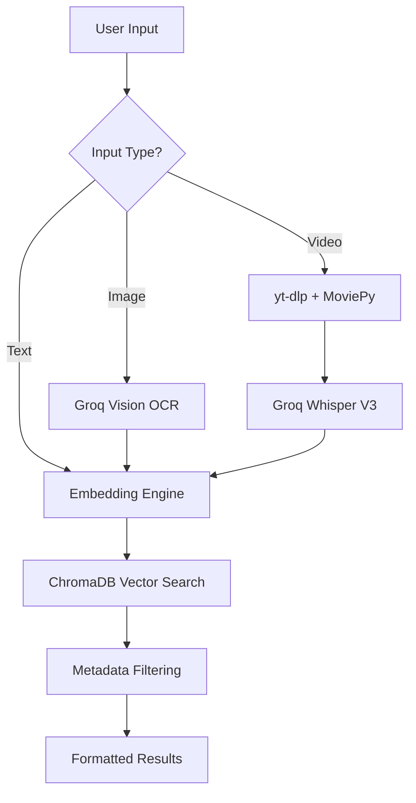

# Islamic Source Finder (ISF)

## 1. High-Level Pitch & Value (For Recruiters)

- **Problem Solved**: Religious scriptures are often cited incorrectly or without context in digital media (images, videos, social media). Manually verifying these sources across voluminous physical or PDF collections is time-consuming and error-prone.
- **Core Features**:
  - **Multi-modal RAG**: Seamlessly query religious databases using raw text, screenshots (Image-to-Source), or YouTube URLs (Video-to-Source).
  - **Automated Digitization**: A specialized ingestion pipeline that converts static, unstructured PDFs into a searchable, vector-indexed database.
  - **Semantic Intelligence**: Uses dense vector embeddings to find relevant passages even when exact keywords differ, overcoming the limitations of traditional lexical search.
- **Value Metric**: Reduces source verification time from minutes to seconds; enables non-experts to validate content authenticity; provides a scalable framework for digitizing legacy religious texts with structural metadata preservation.

## 2. Technical Architecture & Tech Stack (For System Overview)

- **Tech Stack**:
  - **UI/UX**: Streamlit (Interactive Web Interface)
  - **Vector Engine**: ChromaDB (Persistent HNSW Vector Store)
  - **Embedding Model**: `all-MiniLM-L6-v2` (Sentence-Transformers)
  - **Vision AI**: Groq Llama 4 (OCR & Contextual Extraction)
  - **Audio AI**: Groq Whisper-Large-v3 (High-fidelity Transcription)
  - **Media Processing**: `yt-dlp` (Video), `moviepy` (Audio Extraction), `PyPDF2` (Document Parsing)
  - **Core Logic**: Python 3.12+ (Asynchronous orchestrations and singleton-based resource management)

- **System Diagram Flow**:

## 3. Advanced Engineering & Architecture Decisions (For Tech Leads)

- **Design Patterns**:
  - **Singleton Architecture**: Implemented `IslamicSourceFinderClient` as a singleton to maintain a persistent connection to the vector database and prevent redundant model initializations across Streamlit re-runs.
  - **Resource Lazy-Loading**: Optimized startup latency by deferring the loading of the `SentenceTransformer` model until the first actual computation request.
  - **Atomic Context Management**: Utilized Python context managers for temporary file handling, ensuring that scratch files created during video/image processing are deleted immediately after use.

- **Performance & Constraints**:
  - **Batch Processing**: Implemented dual-layer batching (32 for inference, 2000 for storage) to stay within ChromaDB's operational limits and optimize GPU/CPU throughput during bulk PDF ingestion.
  - **Memory Conservation**: Media files (Video/Audio) are streamed to disk rather than held in RAM, allowing the system to process large high-definition video queries on low-resource environments.

- **Edge-Case Handling**:
  - **Idempotent Ingestion (MD5 Hashing)**: Prevents database pollution by calculating MD5 hashes of PDF contents; the system automatically skips already-processed files unless a force-reload is triggered.
  - **Resilient Media Pipeline**: Integrated `atexit` hooks to ensure that temporary media artifacts (downloaded MP4s, extracted WAVs) are purged even in the event of an unexpected application crash.
  - **Structural Metadata Extraction**: Uses targeted regex-based boundary detection to maintain the "Book/Hadees" hierarchy during chunking, ensuring that search results are always returned with accurate citations.
